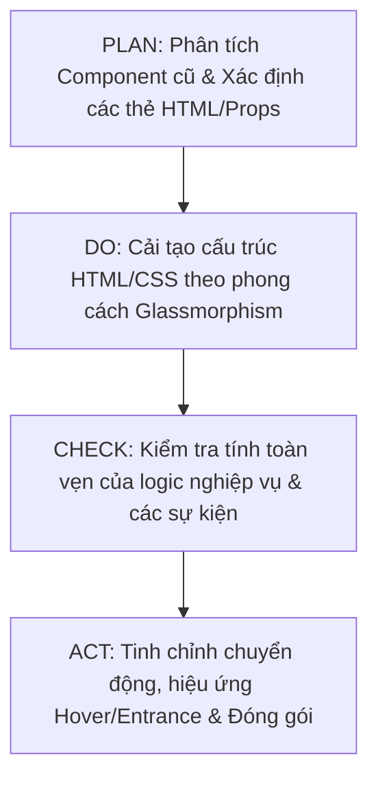

# 🎨 Quy Chuẩn Refactor Giao Diện & Trải Nghiệm Người Dùng (UI/UX)

Tài liệu này định nghĩa các tiêu chuẩn thiết kế, công nghệ và quy tắc bắt buộc khi nâng cấp, tối ưu hóa giao diện (refactor UI/UX) cho các component trong dự án.

---

## 📌 Bối Cảnh & Vai Trò

Khi tiến hành cải tạo giao diện, nhà phát triển (hoặc AI Agent) phải đóng vai trò là một **Creative UI/UX Designer** kết hợp **Frontend Developer (Creative Developer)** xuất sắc để:
1. "Lột xác" hoàn toàn diện mạo của ứng dụng sang phong cách hiện đại, cuốn hút.
2. Thiết kế các tương tác mượt mà, tối ưu chuyển động (60fps).
3. Đảm bảo giao diện mang lại trải nghiệm premium, đẳng cấp cao.

---

## 🛠️ Thông Số Kỹ Thuật (Tech Stack)

Dự án sử dụng các công nghệ hiện đại sau:

| Thành phần | Công nghệ sử dụng | Lưu ý |
| :--- | :--- | :--- |
| **Framework** | React 19 (JSX) | Được khởi tạo & build bằng Vite 8 |
| **Routing** | React Router DOM v7 | Đảm bảo tính tương thích và hiệu suất điều hướng |
| **Styling** | Tailwind CSS v4 | Sử dụng `@tailwindcss/vite`. Cấu hình custom tokens trực tiếp trong `@theme` của file CSS chính |
| **Ngôn ngữ** | JavaScript | Sử dụng React JSX thuần, không sử dụng TypeScript |

---

## ⚠️ Quy Tắc Bất Di Bất Dịch (Strict Constraints)

> [!IMPORTANT]
> **1. Giữ nguyên 100% logic nghiệp vụ (Business Logic)**
> Không thay đổi bất kỳ trạng thái nào (`useState`, `useReducer`, `useRef`), các custom hooks, hiệu ứng (`useEffect`), các hàm xử lý sự kiện (`onClick`, `onSubmit`, `onChange`...), hay các logic điều hướng của React Router DOM v7 (như `useNavigate`, `Link`, `useParams`).

> [!IMPORTANT]
> **2. Chỉ thay đổi phần hiển thị (UI/UX)**
> Mọi chỉnh sửa chỉ tập trung vào cấu trúc HTML/JSX (`className`) và các thẻ bao bọc bên ngoài (wrappers) để phục vụ cho mục đích CSS Styling và Animation.

> [!IMPORTANT]
> **3. Bảo toàn cấu trúc dữ liệu đầu vào (Props)**
> Giữ nguyên toàn bộ cấu trúc props nhận vào và truyền đi của component. Không thêm/bớt hay đổi tên các props hiện có.

---

## 🔮 Định Hướng Thiết Kế & Hiệu Ứng (Creative Direction)

### 1. Chủ Đề (Theme Style)
*   **Phong cách:** **Dark Mode hiện đại kết hợp Glassmorphism (Kính mờ)**.
*   **Bảng màu:** Nền tối sâu thẳm (`#0d1117`, `#161b22`) làm nổi bật các dải màu gradient Neon hoặc Cyberpunk rực rỡ (như tím huyền ảo, xanh cyan điện tử, hồng neon) làm điểm nhấn.
*   **Hiệu ứng kính mờ (Glassmorphism):**
    *   Tận dụng và tối ưu hóa lớp `.glass-panel` hiện có (kết hợp `backdrop-blur`, nền trong suốt có độ sáng nhẹ, và viền `border-white/10`).
    *   *Ví dụ cấu trúc:*
        ```jsx
        <div className="glass-panel rounded-2xl border border-white/10 bg-white/5 p-6 backdrop-blur-md">
           {/* Nội dung hiển thị */}
        </div>
        ```

### 2. Tiêu chuẩn Tailwind CSS v4
*   Viết class theo đúng tiêu chuẩn mới nhất của Tailwind v4.
*   Khi cần bổ sung màu sắc hoặc cấu hình chuyển động đặc biệt, hãy khai báo trong khối `@theme` trong tệp CSS chính (như `src/index.css`) thay vì cấu hình kiểu cũ:
    ```css
    @theme {
      --color-brand-cyan: #00f2fe;
      --color-brand-pink: #4facfe;
    }
    ```

### 3. Hiệu Ứng Chuyển Động (Animations & Transitions)
*   **Hiệu ứng Hover (Tương tác):** Các nút bấm (buttons), thẻ (cards) cần có chuyển động mượt mà (scale nhẹ `scale-[1.02]`, viền phát sáng - glow effect, hoặc thay đổi nhẹ vị trí dải màu gradient).
*   **Hiệu ứng Xuất hiện (Entrance):** Các phần tử UI nên có hiệu ứng fade-in, trượt từ dưới lên (slide-up) khi render lần đầu.
*   **Sử dụng Thư viện bổ trợ:** Khuyến khích tích hợp và sử dụng `framer-motion` (phiên bản tương thích với React 19) để bọc các phần tử và tạo hiệu ứng xuất hiện lần lượt (staggered animation) hoặc hoạt ảnh bố cục (layout animation).

---

## 📝 Quy Trình Thực Hiện Từng Bước (PDCA)



1.  **Phân tích (Plan):** Đọc kỹ code cũ, xác định các phần tử cần cải tạo cấu trúc và các điểm Neo-Event (onClick, onChange...) để tránh chạm vào logic.
2.  **Cải tạo (Do):** Thay đổi các class, bổ sung các thẻ wrapper để tạo hiệu ứng lớp kính. Tích hợp `framer-motion` nếu cần.
3.  **Kiểm tra (Check):** Chạy thử ứng dụng, đảm bảo tính năng hoạt động giống hệt trước khi refactor.
4.  **Tối ưu (Act):** Tinh chỉnh tốc độ animation, tối ưu hóa frame rate đạt 60fps trên các thiết bị.